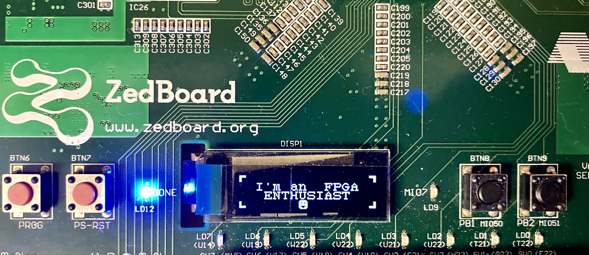

### Hi there 👋. I'm Kiran.

I work as Graduate Research Assistant and at Wright State University while I pursue my Doctoral degree .

My background includes Digital Design, RTL design, FPGA prototyping, Circuit design, and I have worked as a graduate teaching assistant while pursuing a Master’s Degree in Electrical Engineering at Wright State University, OH.

As a teaching assistant I Instructed students in modeling digital systems using VHSIC hardware descriptive language. Implemented and tested the designs on FPGAs. Evaluated the student's performance based on quizzes and graded them accordingly for Digital Integrated Circuit Design Lab (EE 4620L/EE 6620L).

## About Me:

- 🔭 I’m currently working on completing my Ph.D :persevere: :sweat:.
- 🌱 I’m currently learning new technology in the field of digital design.
- 👯 I’m looking to collaborate with other FPGA enthusiasts :handshake:.
- 💬 Ask me about FPGAs.
- 😄 Pronouns: Key-ran :rofl:.
- ⚡ Fun fact: I love photography :camera_flash:.
- :goal_net: 2020 Goals: Survive the pandamic	:mask:.

FPGAs are mostly compared to _LEGO_ blocks where you can build a complex structure using small basic blocks. In my GitHub repositories I present to you some of these basic  build blocks ( in verilog/system verilog) that can be used as a foundation for building big and complex designs.

✨ `Share Knowledge, Spread Love.` ✨

## Connect With me:
[][website]
[][linkedin]
[][instagram]
[][twitter]

 
 

[website]: https://kiranj.com/
[linkedin]: https://www.linkedin.com/in/kiran760043/
[instagram]: https://www.instagram.com/kireative_/
[twitter]: https://twitter.com/kiran760043
